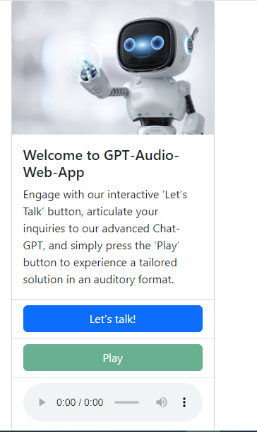

# Gpt-Audio-Web-App
This project involves a Node.js bot that interacts via a web app, interprets voice input, and responds using GPT. It converts voice to text, processes it with GPT, converts the response to spoken word, and sends it back. The goal is voice-based communication with GPT through a web interface.

Getting Started
Follow these steps to run the project locally:

Prerequisites
1. Node.js
2. NPM

Installation
1. Clone the repository to your local machine.
2. Navigate to the project's root directory.
3. Run npm install to install the project dependencies.

Configuration
1. Create a .env file in the project's root directory.
2. Add the following configuration variables to the .env file:
   API_KEY: Your API key for accessing the GPT service.
   ORGANIZATION_KEY: Your organization key for authentication.

Starting the Server
1. Run nodemon app.js in the console to start the server.
2. Open your web browser and go to http://localhost:3000/ to access the    web application.

Usage
1. On the web application, click on the "Let's Talk!" button to ask a query to the bot.
2. After a brief moment, the bot will generate a response.
3. Click on the "Play" button to listen to the bot's response.
